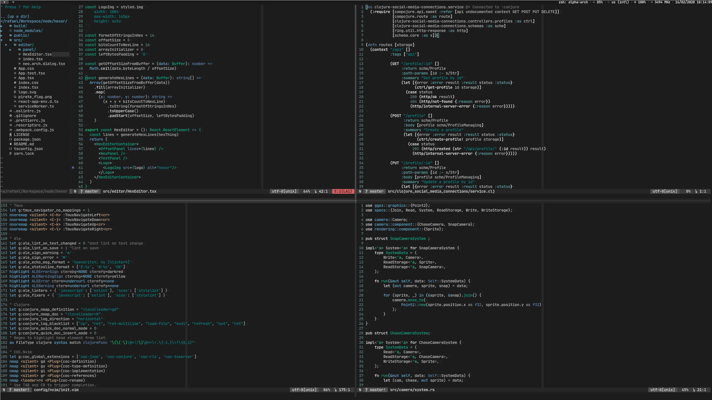

# Novum Scheme for Vim

Vim color scheme based on [Novum](https://github.com/dylnmc/novum.vim).

## A Couple of Notes

- I removed and added colors for my personal experience
- Terminal colors are much different and simplified

## Installation
Using [vim-plug](https://github.com/junegunn/vim-plug):

    Plug 'rafaeldelboni/novum.vim'

Or any other plugin manager of your choice.

### Modify .vimrc

Set the colorscheme in your .vimrc/init.vim
```vim
  syntax on
  set t_Co=256
  colorscheme novum
```


## Screenshots



## License

MIT
